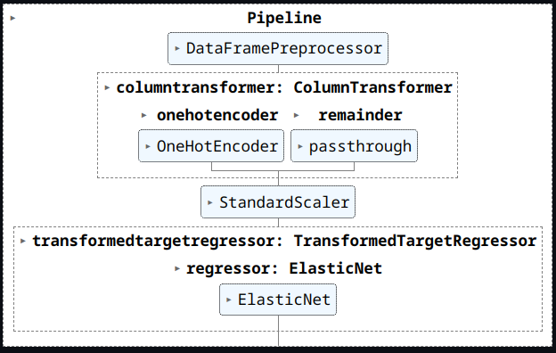
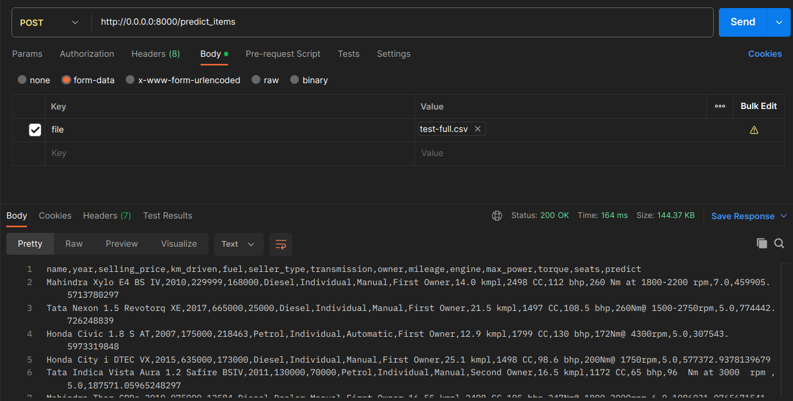
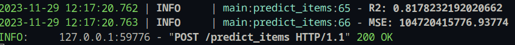

### Что было сделано

- Все задания по пунктам
- Попробовал засунуть весь пайплайн в один pickle файл

### С какими результатами

Основные задания вроде без особых проблем. Опишу FastAPI часть.

- Создал pipeline

- В класс `DataFramePreprocessor` засунул всю предобработку датафрейма, которую делали на протяжении всего ноутбука
- В пайплайне после предобработки датасета вызывается one-hot-encoding категориальных колонок
- Далее производится масштабирование всех признаков `StandardScaler()`
- Finally, `ElasticNet` оборачивается классом `TransformedTargetRegressor`, который отвечает за логарифмирование таргета и инверсию логарифмирования для вывода результата и подсчета метрик
- Подобрал параметры для `ElasticNet` с помощью `GridSearch`
- На тесте получил метрики:
  - R2: 0.8178232192020662
  - MSE: 104720415776.93774
- Сохраняю весь пайплайн в pickle файл
- В `main.py` загружаю `pickle` и реализую два запроса. Результат буду смотреть в `Postman`
- `/predict_item` - предсказывает цену для одного объекта. Отправлю первый объект из теста (`test-single.json`) в формате `.json`. Получаю ответ - одно число.

- `/predict_items` - предсказывает цены для множества объектов из `.csv` файла. Возвращает `.csv` файл с дополнительной колонкой `predict` с предсказанными значениями. Также считает метрики и логирует их в консоль. Отправлю целиком тестовый датасет (`test-full.csv`).

Метрики из консоли

Получили тоже самое, что и в ноутбуке, значит всё работает правильно.

### Что дало наибольший буст в качестве

- Логарифмирование таргета

### Что сделать не вышло и почему (это нормально, даже хорошо😀)

- Сделать пайплайн без костылей - хотелось сохранить всю модель и предобработку в один pickle файл, но это оказалось довольно сложной задачей.
  - Чтобы сохранить весть пайплайн, который имеет сложную структуру (один класс `DataFramePreprocessor` тянет за собой несколько функций), pickle оказалось недостаточно.
  - Поэтому я вынес всю предобработку и обучение в один файл `train.py`
  - И исползовал [`dill`](https://proglib.io/p/kak-hranit-obekty-python-so-slozhnoy-strukturoy-moduli-pickle-i-dill-2020-04-30) заместо `pickle`, который лучше хранит сложные объекты.
- Когда в `sklearn.Pipeline` применяется какая-то обработка, например, `StandartScaler` или `OHE`, то возвращается `np.ndarray`, а не `pd.DataFrame`, что не позволяет дальнейшим обработчикам обращаться к признакам по названиям колонок.
